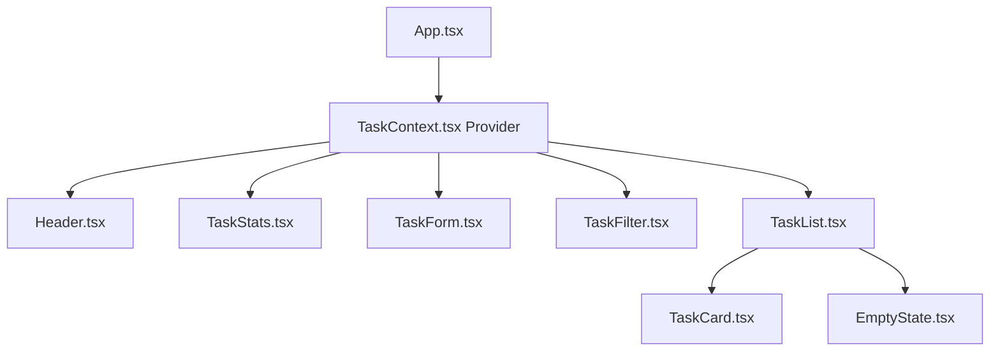

# AcademiaTask: Concepts & Architecture Documentation

This document provides a comprehensive breakdown of the component architecture, data workflows, functions, and fundamental React concepts utilized in the **Student Task Manager (AcademiaTask)** project.

---

## Part 1: Component Architecture & Workflows

Our application is split into highly modular, single-responsibility components. This structure keeps the code clean, readable, and easy to maintain.



### Component Breakdown & Responsibilities
1. **[App.tsx](file:///c:/projects/intership/src/App.tsx) (Application Root & Layout Shell)**:
   - Wraps the entire layout inside `<TaskProvider>` so all nested components can access the global state.
   - Manages local states for searching and filtering (`searchQuery`, `statusFilter`, `priorityFilter`) and coordinates passing them to the controls and lists.
2. **[TaskContext.tsx](file:///c:/projects/intership/src/context/TaskContext.tsx) (Global State & Business Logic)**:
   - Implements the React Context Provider.
   - Holds the main `tasks` state list, active `editingTask` state, and handles the Core CRUD logic (Adding, Updating, Deleting, and Toggling Status).
   - Syncs the task database with the browser's `localStorage` automatically.
3. **[Header.tsx](file:///c:/projects/intership/src/components/Header.tsx) (Minimalist Title Branding)**:
   - Renders a clean academic title banner, description, and status tags. Completely visual and static.
4. **[TaskStats.tsx](file:///c:/projects/intership/src/components/TaskStats.tsx) (Dashboard Metrics)**:
   - Reads the global `tasks` state.
   - Computes stats (total tasks, completion percentage, pending counts, and priority levels) and presents them inside neat white metric boxes.
5. **[TaskForm.tsx](file:///c:/projects/intership/src/components/TaskForm.tsx) (Dual-mode Creator & Editor Form)**:
   - Captures user input (Task Name, Description, Priority).
   - Validates that fields are not empty before submitting, rendering custom warning text under input fields.
   - Listens to the global `editingTask` state via `useEffect` to pre-populate inputs when entering Edit Mode.
6. **[TaskFilter.tsx](file:///c:/projects/intership/src/components/TaskFilter.tsx) (Search & Filter Navigation)**:
   - Renders a search input field and two button tab selectors (Status tabs and Priority tabs).
   - Emits change events back to `App.tsx` through callback props.
7. **[TaskList.tsx](file:///c:/projects/intership/src/components/TaskList.tsx) (Task Aggregator & Filter Pipeline)**:
   - Accesses global `tasks` state and filters them based on search queries and filter tabs passed from the parent.
   - Maps through filtered items to render individual `TaskCard` elements.
   - Displays `EmptyState` if no matching tasks are found.
8. **[TaskCard.tsx](file:///c:/projects/intership/src/components/TaskCard.tsx) (Task Display & Interaction Card)**:
   - Renders a single task details.
   - Hosts interactive controls (Check status box, Edit selection, Delete button).
   - Diminishes opacity and applies line-through styles to text when the task is marked as "Completed".
9. **[EmptyState.tsx](file:///c:/projects/intership/src/components/EmptyState.tsx) (Visual Placeholder)**:
   - Displays illustrative graphics and helpful contextual prompts when the planner is empty or filters return zero matches.

---

## Part 2: React Concept Explanations

### 1. Functional Components
* **What is a Component?**
  A component is a self-contained, reusable block of UI code that returns HTML-like markup (JSX) and manages its own logic. Think of it like a custom HTML tag with superpower logic.
* **Why are Components Reusable?**
  Components are reusable because they do not hardcode specific data. Instead, they act as templates. For example, a single `TaskCard` component can render 1,000 different tasks simply by receiving different data inputs (props).
* **How do Components Communicate using Props?**
  Data flows in React from parents to children via **Props** (Properties). A parent passes variables or functions down to a child component, which receives them as arguments. For example:
  ```tsx
  // Parent (App.tsx)
  <TaskFilter searchQuery={searchQuery} setSearchQuery={setSearchQuery} />
  
  // Child (TaskFilter.tsx)
  const TaskFilter: React.FC<TaskFilterProps> = ({ searchQuery, setSearchQuery }) => { ... }
  ```

### 2. useState
* **What is State?**
  State is an object or value managed locally within a component that holds information that might change over the lifecycle of the application. Unlike local variables, when state changes, React is notified.
* **Why State Changes Trigger UI Updates:**
  When you call a state updater function (like `setTasks` or `setName`), React schedules a **re-render** for that component. React recalculates the virtual representation of the component's UI and updates the actual browser DOM to match the new state values.
* **Why Direct State Mutation Should Be Avoided:**
  You must never mutate state directly (e.g., `tasks.push(newTask)` or `task.status = 'Completed'`). React relies on shallow comparison (reference checks) to know if state changed. If you mutate state directly, the memory address of the object remains the same, React fails to detect the change, and the UI will not update. Always use updater functions with copy patterns (like the spread operator `[...prevTasks]` or map `prevTasks.map(...)`).

### 3. useEffect
* **Component Lifecycle:**
  A component goes through three main phases:
  1. **Mounting**: Rendered on the screen for the first time.
  2. **Updating**: State or props change.
  3. **Unmounting**: Removed from the screen.
* **Dependency Array:**
  The second argument passed to `useEffect` controls when it runs:
  - `useEffect(fn, [tasks])`: Runs on mount, and runs again whenever the `tasks` state changes.
  - `useEffect(fn, [])`: Runs **only once** when the component mounts.
  - `useEffect(fn)` (no array): Runs on every single render.
* **Side Effects:**
  Side effects are operations that interact with the outside world beyond returning JSX, such as fetching data from an API, setting timers, or reading/writing to `localStorage`.
* **Re-render Behavior:**
  If a state variable inside the dependency array changes, the effect executes *after* the browser paints the updated UI. If the effect updates state itself, it triggers another render pass, so developers must be careful to avoid infinite rendering loops.

### 4. useContext
* **The Prop Drilling Problem:**
  When multiple nested components need access to the same state (e.g., `tasks` or `deleteTask`), you have to pass it down through intermediate components that don't need it. This makes code verbose and error-prone.
* **Global State Sharing:**
  Context provides a way to share values between components without explicitly passing props through every level of the tree.
* **Context Provider & Consumer:**
  - **Provider**: Wraps the components tree and supplies the shared value (e.g. `<TaskContext.Provider value={{ tasks, addTask }}>`).
  - **Consumer (useTasks)**: Any nested child component that calls `useTasks()` can directly consume the provider's shared values.

---

## Part 3: Expected Learning Outcomes (Answers to 10 Key Questions)

### 1. What is a Functional Component?
A Functional Component is a standard JavaScript function that accepts props as its input argument and returns a React element (JSX). It is the modern standard for writing React components and utilizes **Hooks** to manage state and lifecycle operations.

### 2. What is useState?
`useState` is a built-in React Hook that declares a state variable in a functional component. It returns a stateful value and a dispatch function to update that value.
```typescript
const [name, setName] = useState('');
```

### 3. What is useEffect?
`useEffect` is a React Hook that lets you synchronize a component with an external system (performing side effects). In this project, it loads initial tasks from local storage on mount, and saves the tasks list to local storage whenever the list is altered.

### 4. What is useContext?
`useContext` is a Hook that reads and subscribes to a React Context. It enables nested components to retrieve global values and state handlers (like `tasks` and `deleteTask`) directly from a parent Provider, eliminating prop drilling.

### 5. What are Props?
Props (short for properties) are read-only inputs passed from a parent component to a child component. They allow components to remain reusable by accepting dynamic configurations and event handlers.

### 6. How CRUD operations work in React?
CRUD operations work by modifying state arrays in an immutable fashion:
- **Create**: Add items using the array spread operator: `setTasks(prev => [newObject, ...prev])`.
- **Read**: Render state arrays inside JSX using `tasks.map(task => <TaskCard key={task.id} task={task} />)`.
- **Update**: Find and replace objects by mapping over the array: `tasks.map(t => t.id === id ? { ...t, ...updates } : t)`.
- **Delete**: Remove items using the filter method: `tasks.filter(t => t.id !== id)`.

### 7. Why components should be reusable?
Reusability prevents code duplication (DRY principle), ensures visual consistency across the application, simplifies maintenance, and makes debugging easier since updates only need to be applied in a single file.

### 8. How React updates the UI?
React maintains a **Virtual DOM** in memory. When state or props change, React creates a new Virtual DOM tree and compares it with the old one (a process called **reconciliation** or **diffing**). It then calculates the minimum set of changes required and updates only those specific parts in the browser DOM, making updates extremely fast.

### 9. How data flows through an application?
In React, data flows in a **one-way downward direction (unidirectional data flow)** from parents to children via props. To send updates back upwards, children trigger callback functions passed down to them as props. Alternatively, global state managers like Context API allow data to bypass intermediate layers entirely.

### 10. How Tailwind CSS helps build responsive interfaces?
Tailwind CSS provides mobile-first utility classes combined with breakpoint prefixes (e.g., `sm:`, `md:`, `lg:`). By writing styles directly inside class parameters (e.g., `grid-cols-1 lg:grid-cols-3`), you can adjust card structures, visibility, paddings, and font sizes dynamically according to screen dimensions without writing manual CSS media queries.
